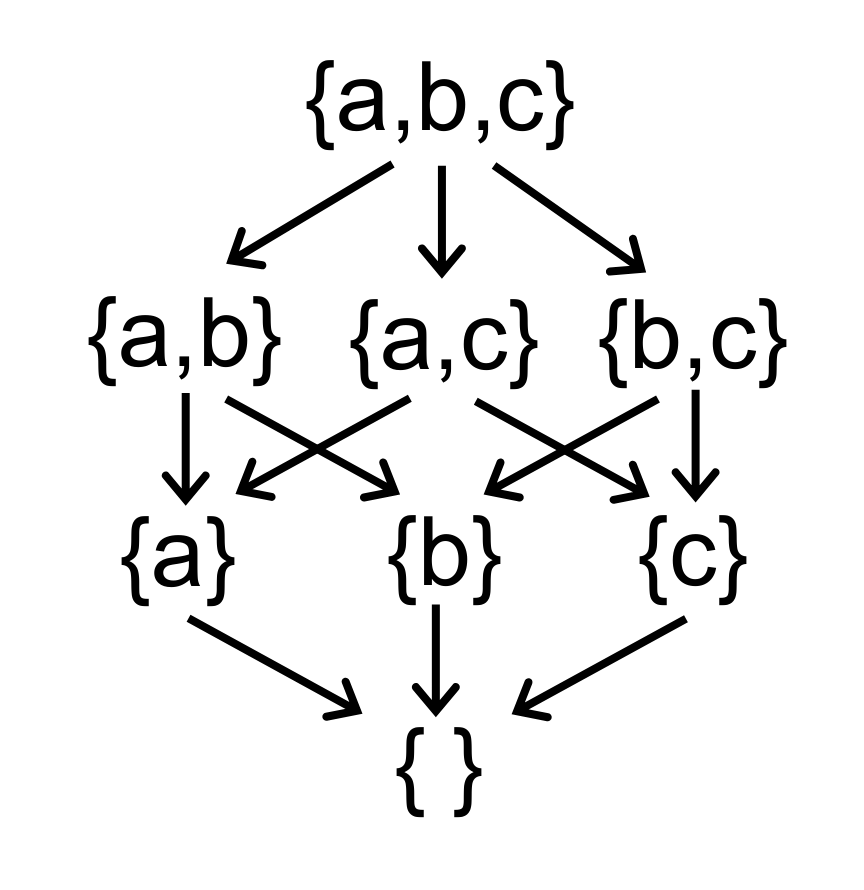

# Static Program Analysis

## Write in Front

HomePage: [Static Program Analysis](https://tai-e.pascal-lab.net/lectures.html)

## Lec1 Introduction

首先需要对 Static Analysis 有一个比较宏观的印象，其属于 PL 应用下的一个分发，出现的背景是虽然编程语言最核心的部分在过去的很长一段时间里，都没有发生本质的变化，但是程序的规模和复杂性却与日俱增，那么该如何确保程序的可靠性、安全性以及其他的一些保证？

也许你会说做好 code review，确实，但将这项艰巨的任务交给人实在是不优雅，程序的事情就让程序自己来解决好了，这就是 Static Analysis 的背景（我以为的）。

深入学习静态程序分析的附加值：

- 更深入的理解编程语言的语法、语义
- 自然而然的写出更可靠、更安全、更高效的程序

那么，究竟什么是程序分析呢？一般认为，程序分析是在程序运行前通过分析出是否具有某些性质。比如，是否存在隐私信息泄漏，是否解引用了空指针，是否安全的进行类型转换，等等等等。

但，有如下定理说明是不可能的。

> Any non-trivial property of the behavior of programs in a recursively enumerable language is undecidable. - Rice's Theorem

莱斯定理很像香农定理之余信息论，并非在否定该方向的发展，而是给定了一个理论上界。

一个好的静态分析，应该在保证尽量接近 soundness 的基础上，在分析精度和分析速度之间权衡。

（算了，这部分不太想写，内容太零碎了，等等再说吧。

## Lec2 Intermediate Representation

源代码到机器代码需要经过词法分析、语法分析、语义分析，然后翻译成 IR，再生成机器代码，整个流程如下图所示：


从图里可以看出，Static Analysis 一般是基于 IR 的，因为前面一些 trivial 的工作，比如语法解析之类，没必要重复做，至于为什么不使用 AST，主要是 IR 的通用性更好，更底层更接近机器代码，语言无关，而且还包含清晰的控制流信息。

当然，IR 也有多种表示形式，比如常见的有 3AC 和 SSA，而课程用到的则是 Tai-e 的 IR。

### Control Flow Graph

虽然 Static Analysis 是基于 IR 的，但并不是直接在 IR 上进行分析，而是将 IR 构建成图模型，比如说这里要说的 Control Flow Graph。

在 CFG 里，最小的单元是 Basic Block，每一个 Basic Block 需要保证只能一个入口和一个出口，即从 Basic Block 的第一条指令进入，从 Basic Block 的最后一条指令出去。

那么，如何将 IR 切分成 Basic Block 呢？感觉这里有一点贪心的思想在里面，即在满足 Basic Block 条件的前提下，尽可能的使得每个 Basic Block 最大化。那么，实际上确定每个 Basic Block 的起始指令和结束指令就可以了。于是，可以得到如下的算法：


对应给出一个例子：


CFG 既然是图，那么出了节点（Basic Block）之外，还需要边，思考该如何加边。首先，IR 到 CFG 的转换过程中，不应该损失信息，那么添加的边必然是原先在 IR 中就存在的，比如说条件跳转和顺序关系。实际上，差不多也就只有这两种情况了。

Basic Block A 到 Basic Block B 之间有一条表，当前仅当如下两种情况：

1. A 的最后一条指令跳转（条件跳转或无条件跳转）到 B；
2. B 紧跟在 A 之后，并且 A 的最后一条语句不是无条件跳转。

加上边的 CFG 如下图所示：


可以看到，最终生成的 CFG 中多个两个 Basic Block，即 Entry 和 Exit，这是为了方便算法的实现。

## Lec3~4 Data Flow Analysis - Application

Static Analysis 的理论是比较抽象的，所以先举几个例子，近几节课主要研究 Data Flow Analysis，有如下经典的例子：

- Reaching Definition Analysis
- Live Variable Analysis
- Available Expression Analysis

在那之前，先来搞明白什么是 Data Flow Analysis。


可知设计 DFA 可以从如下几个方面考虑：

- data abstraction
- flow safe-approximation
- transfer function
- control-flow handling

在 DFA 中，会在每一个 Program Point 上附加一个一些数据，这些数据是在该 Program Point 处可以观测到的程序状态。

### Reaching Definition Analysis


通过在 CFG 的起始节点给所有变量一个不合法的 Definition，那么如果这个 Definition 可以流到变量被使用的地方，就说明出现了 use before define 的情况。

从之前说的四个方面来讲解 Reaching Definition Analysis，即 data abstraction、flow safe-approximation、transfer function 和 control-flow handling。

先来思考数据抽象是什么，不妨从分析的目的的角度来考虑，Reaching Definition Analysis 要分析的是某个 Definition 是否可以流到某个程序点处，那么，就可以定义一个位图，来标识某程序点处是否有其 Definition。

然后再来考虑 flow safe-approximation，显然易知，只要有一条从 q 到 p 的路径，就应该认为 Definition Reach 了，所以这是 may analysis。

接着考虑 transfer function，tansfer function 应用在 CFG 中的节点上，表示数据如何进行状态转换。在 Reaching Definition Analysis 的语境下，容易想到如下的 trafer function：

$$
OUT[B] = gen_{B} \cup (IN[B] - kill_{B})
$$

如何理解呢？这是一个 forward analysis，所以输出是 OUT[B] 自然不用讲。那么在每一个 Basic Block 中，状态如何转移？不妨举个例子，`d: v = x + 1`，那么这个时候变量 `v` 对应的 Definition 在其所在的 Basic Block 是 Reaching 的，同时该 Definition 还会让他处的关于 `v` 的 Definition 变得不 Reaching，这两部分分别对应 transfer function 里的 $gen_{B}$ 和 $kill_{B}$。同时，可以发现，$gen_{B}$ 和 $kill_{B}$ 都只是和当前 Basic Block 相关，换句话说，这些都是静态的在 DFA 进行之前就可以确定的。

这么说还说太抽象，举个例子。


最后来考虑 control-flow handling，control-flow 在 CFG 里的表现形式是 Basic Block 之间的交汇，比如上图里的 B2 和 B3 交汇于 B4 处，那么在 B4 处如何处理来自 B2 和 B3 的数据呢？从语义上考虑，无论是从 B2 流过来还是从 B3 流过来，都是有可能达到 B4 的，这也就是前面说的 may analysis，所以在 B4 处应该对交汇来的数据取并集，即：

$$
IN[B] = \cup _{P \; a \; predecessor B} OUT[P]
$$


至此就可以写出完整的迭代算法：


初看起来，这很像是 CFG 上的广度优先遍历，确实；也有些像是有限状态机（FSM），确实；也有点儿像布尔可满足性问题（SAT），确实。

但无论说它像什么，都有以下三个问题尚未解决：

1. 该算法一定会停止么？
2. 算法的停止状态一定只有一个么？如果多余一个，如何证明算法得到的那一个状态一定是最优的？
3. 若算法会停止，该如何找到这个状态呢？

这些稍后再说，先给出一个例子(建议手推一下)：


### Live Variable Analysis


活跃变量分析给我的感觉很像是在分析 Variable 的 Non-Lexical Lifetime。这里稍微提一下，一般说 Lifetime，都是 Lexical Lifetime，即从声明开始一直到整个语句块结束，此时生命周期是严格按照词法中的作用域范围绑定的。这种设计看起来很简单，但在某些情况下会过于保守甚至严苛，以至于不实用，比如说在 Rust 里，考虑一个非常常见的使用数组切片的例子：

```rust
fn capitalize(data: &mut [char]) {
    for c in data {
        c.make_ascii_uppercase();
    }
}

fn foo() -> Vec<char> {
    let mut data = vec!['a', 'b', 'c', 'e'];
    capitalize(&mut data[..]);
    data.push('d');
    data.push('f');
    data
}

fn main() {
    let v = foo();
    println!("{:#?}", v);
}
```

调用`capitalize()` 时传参会创建一个临时的 `&mut` 型引用，并在函数结束后销毁，因而返回 `foo` 函数里仍旧可以继续使用 `data` 对数据进行操作。

但如果我手动的把传参创建的临时变量写出来呢？

```diff
diff --git a/src/main.rs b/src/main.rs
index ab972d0..5be7813 100644
--- a/src/main.rs
+++ b/src/main.rs
@@ -351,7 +351,8 @@ fn capitalize(data: &mut [char]) {

 fn foo() -> Vec<char> {
     let mut data = vec!['a', 'b', 'c', 'e'];
-    capitalize(&mut data[..]);
+    let slice = &mut data[..];
+    capitalize(slice);
     data.push('d');
     data.push('f');
     data
```

那很抱歉，如果按照 Lexical Lifetime 来分析的话，可变引用 `slice` 的生命周期直到 `foo()` 函数最后才结束，那么就同时存在多个可变引用了，因而无法通过编译。

这看起来没问题，但用起来是真难受，明明只是把 `slice` 当作临时变量，并且显式写出来了，编译器为啥不能聪明一点？

这个例子也许会说算了算了，不把 `slice` 写出来不就好了，那，再看下面这个例子：

```rust
fn proces_or_default<K, V: Default>(map: &mut HashMap<K, V>, key: K) {
    match map.get_mut(&key) {
        Some(value) => process(value),
        None => {
            map.insert(key, V::default());
        }
    }
}
```

定义一个函数，如果 HashMap 里存在相应的 entry 就进行操作，否则插入默认值。看起来很好，但很遗憾的是，无法通过编译（注，HashMap 的 API 在 Rust 2018 有了一些改动，但这不是这里要讨论的问题所在）。因为编译器认为调用 `map.get_mut(&key)` 的时候，产生了一个临时的执行 map 的 `&mut` 引用，并且返回值也包含了一个引用，且返回的引用的生命周期不比参数的生命周期短，而参数的生命周期显然是整个函数体，那么第 5 行通过数据的持有者 map 来修改数据会不通过，即同时存在了两个可变引用。

为了绕过 Lexical Lifetime Check，需要写成类似如下的形式：

```rust
fn proces_or_default<'m, K, V: Default>(map: &'m mut HashMap<K, V>, key: K) -> &'m mut V {
    if map.contains(&key) {
        return match map.get_mut(&key) {
            Some(value) => value,
            None => unreachable!(),
        };
    }

    map.insert(key, V::default());
    map.get_mut(&key).unwrap();
}
```

实际上是通过 `if` 缩小了生命周期，当然，目前版本的 HashMap 已经好用很多的了，可以很方便的写出：

```rust
fn proces_or_default<'m, K, V: Default>(map: &'m mut HashMap<K, V>, key: K) -> &'m mut V {
    map.entry(key).or_insert_with(|| V::default())
}
```

这反映出至少就 Rust 而言，基于 AST 做生命周期分析是一件吃力不讨好的事情，因而 Rust 的生命周期目前是基于 IR 的 Non-Lexical Lifetime。

扯远了，继续说回 Live Variable Analysis。同样从上面提到的四个方面来分析如何设计算法。这里不再详述，直接给出。需要注意的是，这次是 forward may analysis。


同样的给出一个例子：


### Available Expression Analysis


这个我感觉是在分析是否能重用上一次表达式的计算结果，那么就需要表达式中的变量在两次计算之间没有被重新定义或者赋值。

这一次和之前的略有不同，是一个 forward must analysis，因为重用计算结果需要确保在所有可能的路径上都是成立的才能进行优化，这使得在初始化的时候，会有些不同。

同样的，直接给出算法。


同样的，给出例子：


### Summary


## Lec5~6 Data Flow Analysis Foundations

### Fix Pointer View of DFA

换一个视角来思考上一讲的迭代算法：


会发现迭代算法就是在给定状态下求不动点。

那么在前面 Reaching Definition Analysis 哪里遗留的三个问题就可以换一种更明确的表述了：

1. 迭代算法是否可以达到不动点以终止，或者说问题是否总是有解？
2. 如果存在不动点，那么是否只有一个？如果有多个，如何保证算法得到的一定是精度最好的那一个？
3. 迭代算法何时才能到达不动点？

此时可以解决这三个问题了，虽然又到了~~枯燥~~有趣的数学时间了。

### Partial Order

定义偏序集（poset）为一个二元组 $(P,  \sqsubseteq )$，其中 $ \sqsubseteq $ 定义了一个 $P$ 上的偏序关系，当然其本身是一个二元关系，并且 $ \sqsubseteq $ 有如下性质：

1. 自反性（$\forall x \in P,x \sqsubseteq x$）
2. 反对称性（$\forall x,y \in P,x \sqsubseteq y \wedge y \sqsubseteq x \Rightarrow x = y$）
3. 传递性（$\forall x,y,z \in P,x \sqsubseteq y \wedge y \sqsubseteq z \Rightarrow x \sqsubseteq z$）

传递性其实是比较容易满足的，主要还是自反性和反对称性。比如说整数集上的 $\le$ 定一个了一个偏序关系，但 $\lt$ 并不是，因为不满足自反性。

既然是一个排序关系，那么自然会想到是否存在最大最小值之类的问题，给出如下定义：


即上界（UB）、下界（LB）、上确界（LUB）、下确界（GLB）。

当然，并非所有的 poset 都有这四个边界，比如下面的例子就没有 glb。


又合理的想到，偏序关系里是否存在一些特殊的值得研究的情况呢？还真有，就是下面要说的 Lattice。

### Lattice

在 poset 里找出一些比较特殊的，即对 poset 里的任意两个元素来说，LUB 和 GLB 都成立的话，就称 $(P, \sqsubseteq)$ 构成一个 Lattice。

Lattice 的例子比如定义在整数集合上的 $\le$，前面说了构成偏序关系，又任意两个元素 $a,b$ 的 LUB 可以认为是 `Max(a, b)`，而 GLB 可以认为是 `Min(a, b)`。

可以想像的到，如果把 Lattice 画出来，应该都是类似下面的形状，即从某一个特定的 source 一直按照某一个特定的方向流入到某一个特定的 destination。其中，特定的方向实际上就是偏序关系 $\sqsubseteq$，特定的 source 是保证 LUB 的存在，记作 top（T），特定的 destination 则是保证 GLB 的存在，记作 bottom（$\perp$）。



说错哩，前面一直在说 complete lattice，这是 lattice 里最特殊的情况，像上面的图里面，已经不是 lattice 定义里的分析元素之间的关系了，变成了分析子集之间的关系。但不算太重要，知道 complete lattice 够用了。

另外，将 Product Lattice 定义为两个 Latiice 之间的笛卡尔积，易知，complete lattice 的 product 仍然是 complete lattice。

至此，可以用 Lattice 来建模 DFA，将 DFA 定义为三元组 $(D, L, F)$。


那么，就可以将 DFA 看作是在 lattice 上迭代的应用 trafer function 和 control-flow handling。

### Fix Point Theorem

前面只是将问题换了一个论域，但并未解决任何一个问题，有一种浅显的感觉，答案和单调性有关，确实是：


~~这里的单调性怎么这么像协变的定义啊~~

不动点原理可以用鸽笼来简单的证明：


至此，可以将 DFA 和不动点原理关联起来。


那么，现在还需要解决的事情就是证明 trafer function 以及 control-flow handling 的单调性。

transfer function 的单调性是好说明的，比如 Reaching Definition Analysis 里的 transfer function：

$$
OUT[B] = gen_{B} \cup (IN[B] - kill_{B})
$$

$gen_{B}$ 和 $kill_{B}$ 都是固定的，而且是取并集，那么只存在 $0 \to 1$ 的转变，即满足反对称性。

至此，前两个问题通过不动点理论可以得解，即算法存在不动点，虽然不动点的数量可能不止一个，但可以保证求得的是最优的（即最大不动点或最小不动点）。

那么，算法何时停止呢？或者说算法的时间复杂度是怎样的。

因为每一次都是在 lattice 的一次状态转移，那么对于高度为 $H$ 的 lattice 来说，每一个 program point 最多进行 $H$ 次状态转移，若记 program point 的数量为 $k$，则算法最坏情况下的时间复杂度为 $k * H$。

至此，三个问题得解。


### Lattice View of May and Must Analysis

还有一个前面没有说清楚的问题，即 May Analysis 和 Must Analysis 的区别。


上面对比图很直观的说明了问题，不管是 May Analysis 还是 Must Analysis，都是从 unsafe state 往 Safe but Useless state 转移，中途在不动点出停下来。那么，根据语义找到 Safe but Useless state，另一边就是迭代的起始状态了。

拿 Live Variable Analysis 来说，这是一个 may backward analysis，在某一点处 Safe but Useless state 是什么呢？显然是所有变量都可能存活，即 top，其对应的状态是所有变量都不可能存活，即 bottom，而 may analysis 是从 bottom 到 top 的转移，所以就可以确定初始状态了。

### Meet Over All Path(MOP)

前面说迭代算法像图的广度优先遍历，那么自然会好奇是否存在深度优先遍历。是有的，即这里说的 MOP。


那么，两种方法最终的结果相同么？如果不相同，谁的精度好一些？


上图是按照 may analysis 得到的 Ours is less precise than MOP 的结论，因为 $MOP \sqsubseteq Ours$ 表明 MOP 在 lattic 上更接近 bottom，也即精度更好。

但是当 transfer function 是可分配的时候，两者在精度上是没有区别的。

而前面的几个例子都是集合的交并操作，这些都是满足分配律的，因而前面的例子两种方式的精度是相同的。

### Constant Propagation

前面的例子中，transfer function 都是满足分配律的，下面介绍不满足分配律的例子，即 Constant Propagation。


Constant Propagation 研究的是在 Program Point P 这一点变量 x 的值是否是一个恒定的常量。

然后来定义 lattice，Domain 的话，就是 UNDEF、C、NAC 三种情况。


随便找个例子，用反正法证明 Constant Propagation 的 transfer function 不满足分配律：


### WorkList Alogirithm

在前面手推状态转移的时候，会发现其实很多情况是不需要重复计算的，比如输入不变的情况下，输出一般都是不变的，因而就有了对迭代算法的优化，引入 WorkList 的概念。

比较好理解，就直接那前面 Available Expression 的例子来说明吧。


## Lec7 Interprocedural Analysis

前面的几个例子，都只是分析了代码片段，或者说都没有跨函数分析，像在 Constant Propagation Analysis 的时候，为了保守期间，只要是函数调用，都认为是 NAC，这会对精度造成很大的损失。因而有了 Interprocedural Analysis 来进行函数间调用分析。

Interprocedural Analysis 是需要 Call Graph 的，对于 OOPL 来说，构建 Call Graph 有四种方法：

1. Class hierarchy analysis(CHA)
2. Rapid type analysis(RTA)
3. Variable type analysis(VTA)
4. Pointer analysis(k-CFA)

速度方面：CHA > RTA > VTA > k-CFA
精度方面：k-CFA > VTA > RTA > CHA

### Function Call In Java

因为主要是针对 Java 进行静态分析，那么首先需要先了解 Java 里存在的几种函数调用：

1. Static Call

   invokestatic，主要是调用静态方法的，所以在编译期就可以决议出目标方法。

2. Special Call

   invokespacial，主要是调用构造方法、私有实例方法、父类实例方法，同样的也可以在编译期决议出目标方法。

3. Virtual Call

   invokevirtual/invokeinterface，其余的实例方法都属于此列，这也是所谓的多态，因而需要在运行期决议目标方法。

### Method Dispatch for Virtual Call

主要分析的是编译期无法决议出的 Virtual Call，首先 Dispatch 需要哪些信息。首先，需要函数签名，其次，如果是 instance method，还需要有调用对象，也就是 receiver object。Java 里的函数签名有如下记法：


也就是说，最先在自己的方法列表中查找，查找不到就到父类中找。举个例子：


那么，现在的问题就变成了构建 Call Graph。

### Class Hierarchy Analysis


CHA 是基于类继承信息的，会使用 receiver variable 的 declared type 做决议，也就是说使用其静态类型。决议的实现很简单，对于 static call 直接返回方法签名；对于 special call，会拿出 signature 中的 class type 去 Dispatch；对于 virtual call，则会对于调用点处的变量的声明类型已经该声明类型的所有子类型中去 Dispatch。算法的伪代码如下：


对于 static call 和 special call 没什么好说的，无论在哪个算法里都差不多。重点在 virtual call 的处理中，从代码中可以知道，直接把类型信息擦除了，会决议出所有可能被调用到的方法（自身类型以及所以该类型的子类型）。

举个例子：


// TODO

这太奇怪了，为啥 `Resolve(a.foo())` 会是这么多啊，不应该只去 `A`、`B` 这两个类里取 Dispatch 么？不会这里的 subclass 包括子类的子类吧？

CHA 速度快，但不精准，一般也就 IDE 里可能会用用。在用 CHA 构建 Call Graph 的时候，一般会将 `main` 之类的入口方法作为起始。

看一个例子：


容易想到，CHA 跑完之后的不可达代码实际上也是 dead code。

### Interprocedural Control Flow Graph

有了 Call Graph 之后，就可以将 CFG 升级到 ICFG 了，需要在 CFG 的基础上添加 call edge 和 return edge。需要注意的是，call-to-return edge 不需要删除，因为 call edge 一般只用来传递函数的参数，而 caller 中还有其他的数据，如果删掉了 call-to-return edge 的话，这部分数据也需要经由 call edge 流向 callee，最终经由 return edge 流回 caller，这实际上不必要的开销。只要在 caller 处将流向 callee 参数的那部分数据 kill 掉即可，不会出现多条路径导致数据重复或者冲突的情况出现的。


### Interprocedural Constant Propagation


可以看到 Interprocedural Analysis 因为没有擦除函数调用信息，因而精度更高。

## Lec8 Pointer Analysis


前面提到了 CHA 来构建 Call Graph，精度并不好，哪怕是 IDE 这种场景，如果尝试跳到某个 instance method 里，出现一串可能的 target method，体验并不好，比如上面 `n.get()` CHA 会给出 `Zero::get()`、`One::get()`、`Two::get()` 三个结果。


指针分析分析的是某一个内存位置可以被哪些指针（这里的指针并非是 C++ 里狭义上指针的概念，对 Java 而言，指针可以是 variable、instance field、array 等等）指向。


虽然看起来有点儿像 Alias Analysis，但其实是不一样的，Pointer Analysis 侧重于分析指针可以指向哪些对象，而 Alias Analysis 侧重于分析是否有两个指针指向了相同的对象。

Pointer Analysis 的应用：

1. 生成基础的信息，比如 Call Graph 和 Aliases 等；
2. 编译优化，比如虚函数调用内联等；
3. 安全分析，比如 Information Flow analysis
4. 等等等等

### Key Factor in Pointer Analysis

感觉上下文分析都做 heap abstraction 了，真的还算是 static analysis 么？已经算是在 Pointer Analysis 的环境里运行了吧？


课程里主要设计的是红色标出的这些：


### Heap Abstraction

Heap Abstraction 需要对程序运行时的堆进行建模，一个首要的问题是遇到下面类似的情况，仍旧可以正常分析：

```java
while (true) {
    A a = new A();
}
```

也就是说程序动态运行时候创建的对象数量在静态分析的时候是无法感知的，那么如何确保抽象对象的有穷性。

#### Allocation-Site Abstraction

一个容易想到的方案是进程是程序的一次执行，虽然无法感知进程的信息，但是程序是静态的，那么对于每一个 Allocation-Site 都创建一个 abstract object，就可以保证其有穷性了。


### Context Sensitivity

简单来说就是否忽略函数调用时候的上下文信息。


### Flow Sensitivity

简单来说就是是否关注指令的有序性，或者说指令的顺序是否在分析的范围内。


### Analysis Scope

Analysis Scope 是说分析的范围是哪些，是直接全程序分析，还是需求驱动的仅仅对需要的部分进行分析。一般来说，都会进行全程序分析，虽然一次全程序分析的速度是要慢于需求驱动分析的，但是全程序分析的结果是可以重复使用的。


### Concerned Statement

在进行 Pointer Analysis 的时候，并非所有的指令都要去分析，比如 `if/else`、`switch case` 这些控制流语句，并不会影响指针， 需要关注是的只有那些能影响到指针的语句。


首先需要明确 Java 里的 Pointer 有哪些。主要是上图里的四种。其中 Static Field 在处理的时候和 Local Variable 基本相同，而 Array element 因为无法静态感知其数组元素个数，因而会将其看作只有一个只有一个 field 的对象，那么此时的情况和 instance field 是相同的。

因而，最终需要关注的 Pinter 只有如下两类：

1. Local Variable: x
2. Instance Field: x.f

说完了 Pointer 的概念，还得说一说有哪些语句可能会影响到指针，在排除控制流语句之后，大概剩下如下五种语句：


## Lec9~10 Pointer Analysis Foundations

再看一眼上一讲说过的会影响到指针的语句:


~~看到推导式形式化方法死去的记忆开始痛击我。~~

### Implement Pointer Analysis


### Pointer Flow Graph

Pointer Analysis 是基于 PFG 的，PFG 上的节点是 Pinter，而节点之间的边表示指针的流向关系。


一个问题是，在上面的图中，如果没有后面两条语句，那么变量 `c` 和其 field f 如何建立关联呢？想不明白。

Pointer Analysis 里的 PFG 是动态建立的，不像之前 Data Flow Analysis 里的 CFG 是在初始的时候就由 IR 完整构建出来的。


### Pointer Analysis Algorithm Without Method Call


这里注意一下，在 propagate point to information 的时候，是进行的增量传播，而非全量传播。首先明确 `pt(n)` 是单调的，只会往里增加，而不会减少。其次，在 `AddEdge(s, t)` 的时候，是进行的全量传播，会将 `<t, pt(s)>` 加入到 WorkList 里面，可以认为将 `pt(s)` 传递到了非联通分量里面。最后，从 WorkList 里取出数据的时候，用 Propagate 增量传播的时候，如果是刚刚新加的边，那么增量其实就是全量，而对于已联通的节点，其传递的则是增量信息（当然，由于流不敏感，且没有规定以何种顺序从 WorkList 里取 entry，有可能这时候节点还没联通，仍旧传播全量信息）。但不管怎么说，增量传播性能总是要好于全量传播的。


### Pointer Analysis Algorithm With Method Call

前面说了影响指针的语句有如下五种：

1. New
2. Aasign
3. Load
4. Store
5. Method Call

前面介绍了没有 Method Call 情况下的上下文不敏感的指针分析，现在加入对 Method Call 的处理。

通过前面对于 Pointer Analysis Alogirithm 的了解，应该有这么一种感觉，Method Call 无非也是在 PFG 上多了些连接节点的规则。

那么，来看看 Method Call Rule 吧，当然，Method Call 必然设计 Interprocedural Analysis，所以是需要 Call Graph 的，而 Call Graph 的构建，之前说了不太精准的 CHA，下面会介绍基于 Pointer Analysis 构建 Call Graph，会看到构建 Call Graph 和构建 Pointer to information 是同时进行的。


可以看到 Method Call Rule 主要做了四件事：

1. Dispatch
2. 传 receiver object
3. 传参数
4. 传返回值

至于为什么不在 PFG 里加入 $x \to m_{this}$ 这条边，我是这么这么理解的，如果加了边，那么可以理解为又是一次 Context InSensitive，并且会将此处的精度损失在整个 PFG 上传播，而每次传过去，就很像是在 Call-Site Sensitive。

有了 Method Call 之后的 Pointer Analysis 算法如下：


之前因为没有 Method Call，实际上是 Intraprocedural Analysis，所以在算法的输入是某个 Method 的语句的集合，那么初始化的时候，将这个 Method 的 New 和 Assign 拿出来初始化就好。但加入 Method Call 之后，算法的输入就是某个函数了，而后面会跳到其他函数来分析，因而需要将对 New 和 Assign 的处理抽出来，单独封装成一个函数，也就是图里的 `AddReachable(m)`。

对于 Method Call 的处理，就是 ProcessCall 了，会找出语句集合里每一次和 x 相关的 Method Call，去做 Dispatch，并将 $m_{this}$ 加入到 WorkList 里。同时，如果从 Call Graph 里没有这条边（$l \to m$），会添加进去，相应的，将 m 标记为可达方法，并处理其中的 New 和 Assign。

算法的主体部分倒是没有什么太大的差别。

看一个例子吧。


## Lec11~12 Pointer Analysis Context Sensitivity


Context InSensitivity Pointer Analysis 处理 Method Call 的时候，不会维护函数间调用的上下文，比如上图里的 `x = id(n1);` 和 `y = id(n2)`，是无法区分多次对于同一个函数的调用的，哪怕是不同的 object 和不同的 parameter。

可以发现，问题出在多次调用了同一个方法，使得原本分离的数据流合并到了一起。一个合理的设想是，能不能在每次 Method Call 的时候，将 Method 拷贝一份，这样就可以做到限制每个 Method Call 只发生一次了，这就是我对 Context Sensitivity 的理解。这有点儿像是对 Call Stack 的抽象。


~~这么看起来，Rust 的生命周期标准和这里的 Context 确实是不一样的。~~


### Context Sensitive Heap

容易想到，Method Call 的时候采用 Cloning-Based Context Sensitivity 的时候，会一起连带着将 Method 里的 Heap 一起复制一份，这样才能将数据流完全分离开来，这即使 Context Sensitive Heap。


学到这里，应该可以有种直觉，C.I. + C.S. Heap 并不能提高精度，事实确实如此。


### Context Sensitive Pointer Analysis Rule


基础的四条 C.S. Rule 和 C.I. Rule 的差别仅仅在于是否有上下文信息。

真正有区别的是 Method Call Rule，里面多了选择上下文信息的操作。


### Context Sensitive Pointer Analysis Algorithm


可以看一下和 C.I. Algorithm 的对比，确实只是在 Method Call 的时候多个 Select 操作，已经其他参数的地方上下文的不同。实际上，C.I. 是 C.S. 的特例，即 Select 选择出来的上下文永远为空，所有参数的上下文也为空。


### Context Sensitive Variants


这就涉及到使用什么作为上下文标记了。

#### Call-Site Sensitivity

Call-Site Sensitivity 是最朴素的想法，记录 Call-Site 就好了，Call-Site 串联起来不就是 Call Stack 么。


但 Call-Site Sensitivity 存在着一定的问题，比如无法处理递归调用。


容易想到可以通过限制 call chain 的长度来解决递归调用时 call chain 无法终止的问题，如下图所示：


看一个例子：


拿之前 C.I. 的结果进行对比，显然 1-call-site C.S. 的精度要好很多。


#### Object Sensitivity


Call-Site 虽然实现简单也容易理解，但是在 OOPL 里，object 的链式调用使得 k-CFA 不那么好用，比如下面的例子里 1-call-site 精度要差于 1-object。


但也并不能说明 Ojbect Sensitivity 要比 Call-Site Sensitivity 要好，比如下面的例子中，1-call-site 就比 1-object 精度要好。


实际上，可以发现，在 OOPL 里，Object Sensitivity 中使用 object 作为 Context 可以穿透调用链，使得 k-object 的 'k' 比实际要大得多。

#### Object Sensitivity


#### Summary


## Lec13 Static Analysis for Security

主要讲了污点分析，但感觉和前面大差不差啊，留着后面整理吧。

## Lec14 Datalog-Based Programming Language

Datalog 是声明式逻辑语言，当然和 SQL 一样似乎只是一个标准，其实现各有不同。


学了这么多语言，感觉 Datalog 就语法上简单得很啊。就不过多介绍了，直接贴 Datalog 实现的 Pointer Analysis Alogirithm。


当然，Datalog 并非完美的，理由如下：

1. Datalog 不是图灵完备的，表达能力有限，如 Datalog 里的数据只能增加，无法删除。
2. Datalog 实际执行是一个黑盒子，看起来简洁的语法背后是执行引擎，这使得将优化的范围缩小了，不利于优化。

### Introduction of Datalog


### C.I. Pointer Analysis via Datalog


### Taint Analysis via Datalog


## Lec15 CFL-Reachability and IFDS

## Lec16 Soundness and Soundiness
